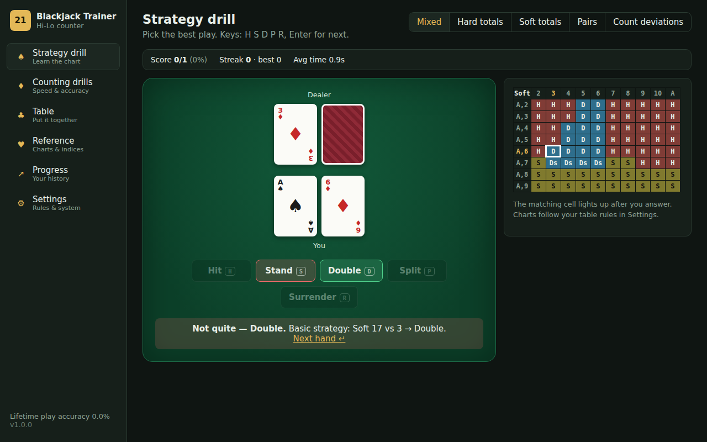
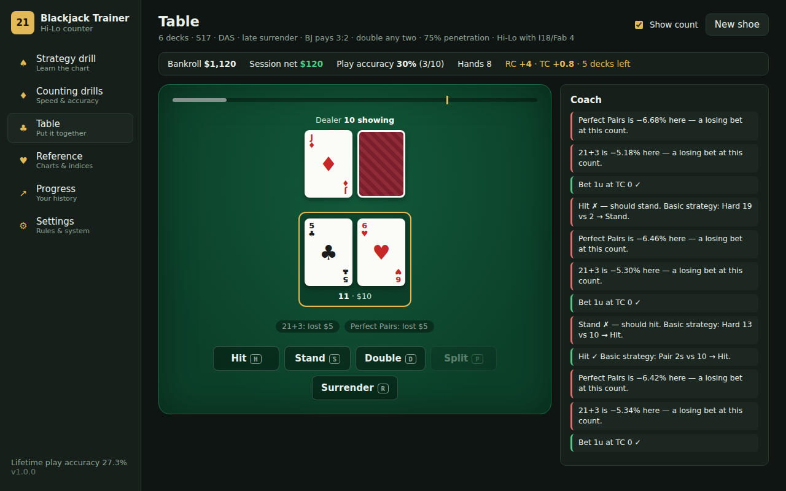
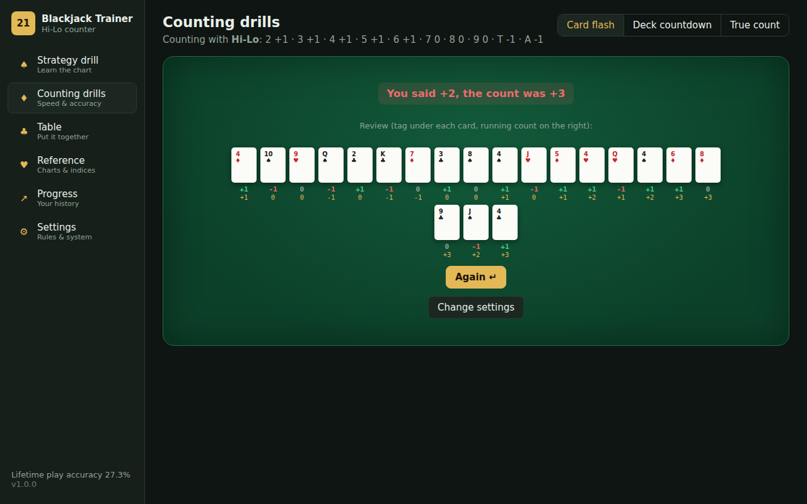
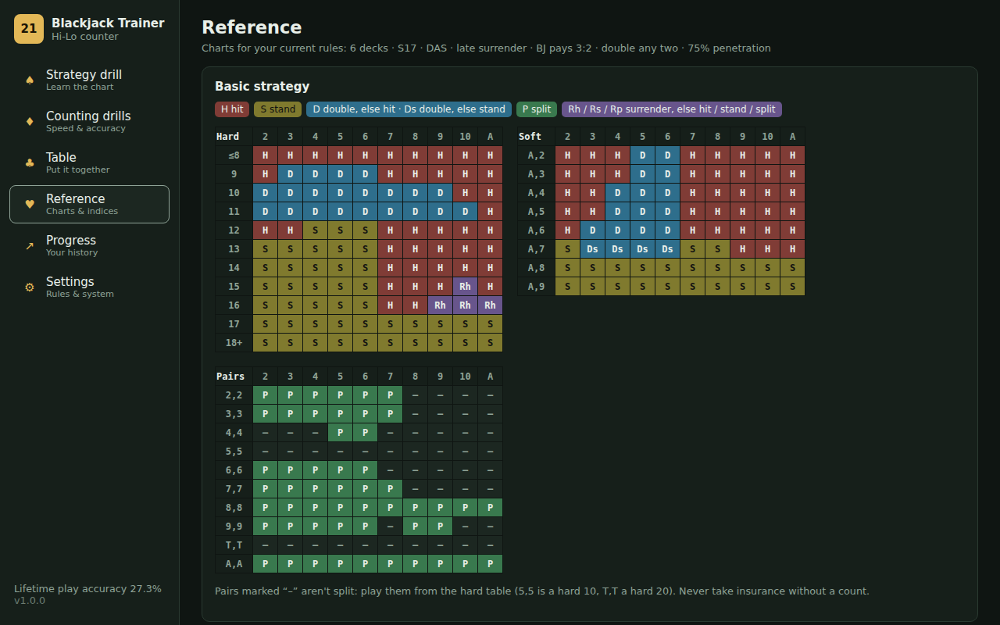
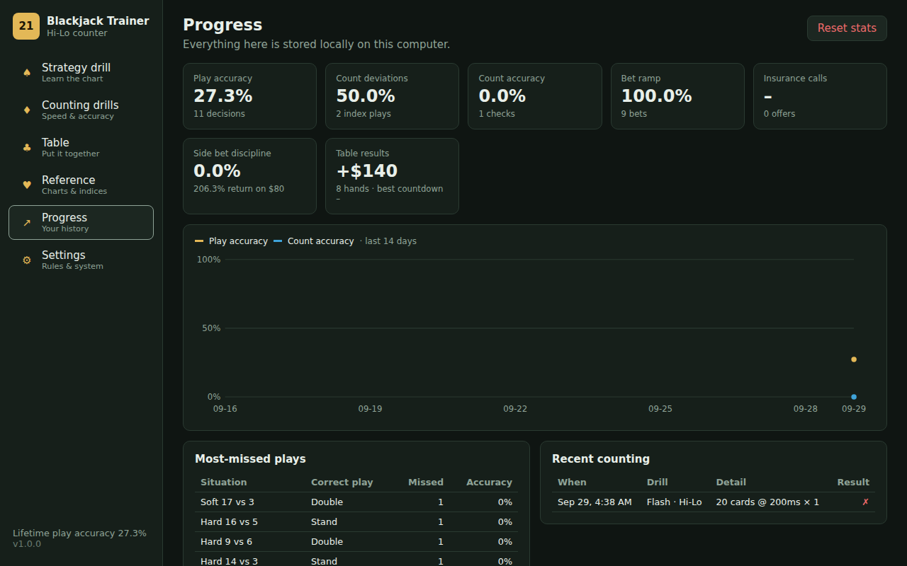

# Blackjack Trainer

A desktop app that trains you to play blackjack well: learn basic strategy, count cards (Hi-Lo, Omega II or Zen), size your bets and use count-based index plays. You then practise it all at a simulated table where every decision is graded. The table can be set to match the casino you'll actually play, including its rule set and side bets.

Version **1.0.0** · Windows, macOS and Linux · Fully offline · MIT licensed



## Contents

- [Features](#features)
- [Tech stack](#tech-stack)
- [Install and run](#install-and-run)
- [How to train with it](#how-to-train-with-it)
- [Keyboard shortcuts](#keyboard-shortcuts)
- [Casino accuracy](#casino-accuracy)
- [Development](#development)
- [Testing](#testing)
- [Building and releasing](#building-and-releasing)
- [Project structure](#project-structure)
- [Data and privacy](#data-and-privacy)
- [Known limitations](#known-limitations)
- [Further documentation](#further-documentation)

## Features

### Strategy drill

- You're dealt a hand against a dealer upcard and choose **Hit, Stand, Double, Split or Surrender**. The answer is graded instantly with a one-line explanation.
- The matching cell lights up on a strategy chart built for **your exact rules** (4/6/8 decks, H17/S17, DAS, surrender, doubling restrictions).
- Focus modes: mixed, hard totals, soft totals, pairs, and **count deviations**. The last one shows a Hi-Lo true count and drills the Illustrious 18 and Fab 4 index plays on both sides of each index.
- Hands are weighted toward the spots players get wrong most, including three-card hands where doubling isn't allowed.
- A session score shows your streak, best streak and average decision time.

### Counting drills

- **Card flash:** 10 to 104 cards at 0.2–2 s per flash, 1–3 cards at a time. Afterwards you review each card's tag and the running count as it went.
- **Deck countdown:** one card is removed secretly and you count the other 51 against the clock. Your final count tells you which card is missing. Personal bests are tracked.
- **True count conversion:** you convert a running count to a true count, using a discard-tray picture to judge how many decks are left.

### Table simulation

- A full shoe with a cut card at your chosen penetration, dealer peek, splits up to 4 hands, optional resplitting of aces, doubling, late surrender, insurance and even money.
- A **coach panel grades every decision**:
  - each bet against your bet ramp (1–4, 1–8 or 1–12 units);
  - each insurance decision against the +3 index;
  - each play against basic strategy plus Hi-Lo index plays;
  - each side bet against its exact expected value (EV) for the cards left in the shoe.
- **Running-count checks** between hands (every 1, 3, 5 or 10 hands) show whether you're keeping up.
- An optional count display shows the running count, true count, decks left and live side-bet EV. There's also an optional hint showing the recommended bet.
- The shoe persists while you visit other screens. It resets when you change the rules or when you ask for a new shoe.

### Side bets

These are the popular side bets found in casinos: **21+3, Perfect Pairs, Lucky Ladies and Buster Blackjack**.

- Each has common paytables to choose from, plus a **custom paytable** so you can copy the one printed on your casino's felt.
- Side bets settle when they would at a real table:
  - 21+3 and Perfect Pairs on the deal;
  - Lucky Ladies after the dealer checks for blackjack;
  - Buster when the dealer finishes. While a Buster bet is in action, the dealer always plays out their hand.
- The app calculates each side bet's **exact EV from the cards left in the shoe**. The coach flags side bets you place at negative EV and any positive-EV spot you pass up. This teaches the real lesson: side bets are almost always bad, and occasionally good deep in the right shoe.



### Reference and progress

- **Reference:** strategy charts for your rules, tag tables for every count system, running-to-true count conversion, your bet ramp, the Hi-Lo index table, and side-bet paytables with their house edge.
- **Progress:**
  - lifetime accuracy for plays, index plays, counting, bet sizing, insurance and side bets;
  - a 14-day accuracy trend;
  - your **most-missed situations** with the correct play for each;
  - a log of recent counting drills.
- **Backup and restore:** export your settings and history to a JSON file, and import it on another machine.

| Counting drills                            | Reference                                    | Progress                                   |
| ------------------------------------------ | -------------------------------------------- | ------------------------------------------ |
|  |  |  |

## Tech stack

| Layer         | Choice                                                                                                   |
| ------------- | -------------------------------------------------------------------------------------------------------- |
| Desktop shell | [Electron](https://www.electronjs.org/) 44, sandboxed renderer with no Node access and no IPC            |
| UI            | [React](https://react.dev/) 19 with hooks and context, hand-written CSS (no UI framework)                |
| Language      | [TypeScript](https://www.typescriptlang.org/) 5.9, `strict`                                              |
| Build         | [Vite](https://vite.dev/) 8                                                                              |
| Packaging     | [electron-builder](https://www.electron.build/): NSIS (Windows), DMG (macOS), AppImage and .deb (Linux)  |
| Unit tests    | [Vitest](https://vitest.dev/), including a multi-ruleset fuzz test of the game engine                    |
| E2E tests     | [Playwright](https://playwright.dev/) against the production build                                       |
| Quality       | ESLint 9 (typescript-eslint, react-hooks), Prettier, EditorConfig                                        |
| CI/CD         | GitHub Actions: CI on every change, installers on version tags, optional GitHub Pages deploy, Dependabot |
| Storage       | `localStorage`, with versioned, validated schemas                                                        |

The engine (`src/engine/`) is plain TypeScript with no React or DOM access. It covers cards, hand totals, strategy tables, counting, index plays, side bets, the round state machine and the drill generator, and it's fully unit-tested.

## Install and run

### Download an installer

Grab the latest build from the repository's [Releases](https://github.com/jrhughes003/Personal-Projects/releases) page:

| OS      | File                                                                              |
| ------- | --------------------------------------------------------------------------------- |
| Windows | `Blackjack-Trainer-<version>-win-x64.exe` (installer)                             |
| macOS   | `Blackjack-Trainer-<version>-mac-arm64.dmg` (Apple silicon) or `-x64.dmg` (Intel) |
| Linux   | `Blackjack-Trainer-<version>-linux-x86_64.AppImage` or `-linux-amd64.deb`         |

The installers are **not code-signed** (see [DECISIONS.md](docs/DECISIONS.md#d15-unsigned-installers)), so your OS will ask for confirmation on first launch:

- **Windows:** SmartScreen will say "Windows protected your PC". Click **More info**, then **Run anyway**.
- **macOS:** right-click the app, choose **Open**, then confirm. You can also go to **System Settings → Privacy & Security → Open Anyway**.
- **Linux (AppImage):** run `chmod +x Blackjack-Trainer-*.AppImage`, then launch the file.

### Run from source

You need **Node.js 20+** (22 recommended; see `.nvmrc`).

```bash
git clone https://github.com/jrhughes003/Personal-Projects.git
cd Personal-Projects/games/blackjack-trainer
npm install
npm run electron:dev      # desktop window with hot reload
```

To run it in a normal browser instead, use `npm run dev` and open http://localhost:5173. The app works identically in a browser; Electron only provides the window.

To build an installer for your own OS:

```bash
npm run dist              # → release/
```

## How to train with it

Here's a suggested order, based on how card counters usually learn:

1. **Basic strategy first.** Set the table rules in **Settings** to match your casino. Then run the **Strategy drill** in _Mixed_ mode until you're above 99% and answering in under a second. Use _Hard_, _Soft_ and _Pairs_ to target weak spots, which the **Progress** page lists under _Most-missed plays_.
2. **Learn the tags.** In **Counting drills → Card flash**, start at 1 s with single cards and go faster over time. Then move to 2–3 cards per flash, since that's how cards look on a real table.
3. **Deck countdown.** Aim to count a deck in under 25 s with no mistakes.
4. **True count.** Practise converting until you can do it instantly. Every bet and index play depends on it.
5. **Index plays.** Use _Strategy drill → Count deviations_ to learn the Illustrious 18 and Fab 4.
6. **Put it together at the Table.** Keep the count display off, turn on count checks, and play whole shoes. The coach shows where your bets, index plays and side bets went wrong.

## Keyboard shortcuts

| Where          | Keys                                                                             |
| -------------- | -------------------------------------------------------------------------------- |
| Drills & table | **H** hit · **S** stand · **D** double · **P** split · **R** surrender           |
| Table          | **1–5** pick a chip · **Enter/Space** deal · **I / N** take or decline insurance |
| Strategy drill | **Enter/Space** next hand                                                        |
| Card flash     | **Enter** start / again                                                          |
| Deck countdown | **Space** or **→** next card                                                     |

Shortcuts are ignored while you're typing in a field, and only apply to the screen you're looking at.

## Casino accuracy

### Rules you can set

| Rule               | Options                                 |
| ------------------ | --------------------------------------- |
| Decks              | 4, 6, 8                                 |
| Soft 17            | Dealer stands (S17) or hits (H17)       |
| Blackjack pays     | 3:2 or 6:5                              |
| Double down        | Any two cards, hard 9–11, or hard 10–11 |
| Double after split | On / off                                |
| Late surrender     | On / off                                |
| Resplit aces       | On / off                                |
| Maximum hands      | 2, 3 or 4                               |
| Penetration        | 50–90%                                  |

The dealer always checks for blackjack first (US style). Split aces get one card each. The strategy charts and the grading change with each of these rules.

### Counting systems

| System   | 2   | 3   | 4   | 5   | 6   | 7   | 8   | 9   | T   | A   | Level |
| -------- | --- | --- | --- | --- | --- | --- | --- | --- | --- | --- | ----- |
| Hi-Lo    | +1  | +1  | +1  | +1  | +1  | 0   | 0   | 0   | −1  | −1  | 1     |
| Omega II | +1  | +1  | +2  | +2  | +2  | +1  | 0   | −1  | −2  | 0   | 2     |
| Zen      | +1  | +1  | +2  | +2  | +2  | +1  | 0   | 0   | −2  | −1  | 2     |

Index plays (the Illustrious 18 and Fab 4 surrenders, plus insurance at +3) are graded only with Hi-Lo, because those are the published indices.

### Side-bet house edges (built-in paytables, full shoe)

These are computed by the app's own engine, not quoted from elsewhere, and a unit test cross-checks them against a brute-force count and two published figures.

| Side bet         | Paytable (to 1)                                | 6 decks | 8 decks |
| ---------------- | ---------------------------------------------- | ------- | ------- |
| 21+3             | 100 / 40 / 30 / 10 / 5                         | 4.62%   | 3.70%   |
| 21+3             | Classic 9:1 on any hand                        | 3.24%   | 2.74%   |
| Perfect Pairs    | 25 / 12 / 6                                    | 6.11%   | 4.10%   |
| Perfect Pairs    | 30 / 10 / 5                                    | 5.79%   | 3.37%   |
| Lucky Ladies     | 1000 / 200 / 25 / 10 / 4                       | 17.64%  | 16.73%  |
| Lucky Ladies     | 1000 / 125 / 19 / 9 / 4                        | 24.71%  | 24.05%  |
| Buster Blackjack | 250 / 100 / 50 / 9 / 2 / 1 (8+ … 3 cards), S17 | 5.75%   | 5.75%   |

Paytables vary a lot between casinos. If yours differs, choose **Custom…** in Settings and type in the pays from the felt; every EV and grade then follows your numbers.

## Development

```bash
npm install
npm run electron:dev    # Vite + Electron with hot reload
npm run dev             # browser only
```

| Script              | What it does                                                      |
| ------------------- | ----------------------------------------------------------------- |
| `npm run check`     | Typecheck, lint, format check and unit tests: run before pushing  |
| `npm run typecheck` | `tsc -b` over the app and the Node-side configs                   |
| `npm run lint`      | ESLint                                                            |
| `npm run format`    | Prettier, rewriting files                                         |
| `npm test`          | Vitest unit tests                                                 |
| `npm run test:e2e`  | Playwright end-to-end tests against the production build          |
| `npm run build`     | Production web build into `dist/`                                 |
| `npm run electron`  | Run Electron on the last `dist/` build                            |
| `npm run dist`      | Build and package an installer for the current OS into `release/` |

Conventions: Prettier formatting, no lint warnings, engine logic stays in `src/engine/` with tests next to it, and UI screens live in `src/modes/`. See [CONTRIBUTING.md](CONTRIBUTING.md).

## Testing

- **Unit tests (Vitest, 78 tests):**
  - strategy cells for every rule variant;
  - index plays, including how surrender interacts with them;
  - that each count system sums to zero over a full deck, and the bet ramps;
  - payouts, splits, resplitting aces, doubling restrictions, insurance and every side-bet settlement path;
  - side-bet probabilities against a brute-force check;
  - settings and stats migration, and backup parsing.
- **Fuzz test:** plays 3,000 rounds under each of three different rule sets using the recommended plays, with side bets on every other round. It checks that no illegal move is ever taken, that bankroll changes match each round's settlement, and that the running count always matches the cards dealt.
- **End-to-end (Playwright):**
  - drills grade answers;
  - the table plays hands and keeps its shoe across screens;
  - side bets can be enabled, placed and settled;
  - the true-count drill checks answers;
  - settings survive a reload;
  - every screen renders.

```bash
npm test
npx playwright install chromium   # first time only
npm run test:e2e
```

If you already have Chromium installed, set `PW_CHROMIUM_PATH=/path/to/chrome` to skip the download.

## Building and releasing

CI (`.github/workflows/blackjack-trainer-ci.yml`) runs on every push and pull request that touches `games/blackjack-trainer/`. It runs the typecheck, lint, format check, unit tests, build and the Playwright suite.

To publish a release:

1. Bump `version` in `package.json` and add an entry to `CHANGELOG.md`.
2. Commit, then tag and push the tag. The tag must match the version:
   ```bash
   git tag blackjack-trainer-v1.0.0
   git push origin blackjack-trainer-v1.0.0
   ```
3. `blackjack-trainer-release.yml` builds on Windows, macOS and Linux, runs the tests, and attaches the installers to a GitHub Release.

**Web version (optional):** `blackjack-trainer-pages.yml` publishes the browser build to GitHub Pages. It's manual-only (**Actions → Blackjack Trainer web deploy → Run workflow**), so publishing is always a deliberate step. Once published, the site lives at `https://jrhughes003.github.io/Personal-Projects/`. First set **Settings → Pages → Source** to _GitHub Actions_.

## Project structure

```
games/blackjack-trainer/
├── electron/main.cjs        Electron main process (window, security, single instance)
├── src/
│   ├── engine/              Pure game logic + unit tests
│   │   ├── cards.ts         Cards, shoes, shuffling, seeded RNG
│   │   ├── hand.ts          Totals, soft/hard, blackjack, pairs
│   │   ├── rules.ts         Table rules and descriptions
│   │   ├── strategy.ts      Basic-strategy tables and move resolution
│   │   ├── deviations.ts    Illustrious 18 / Fab 4 / insurance
│   │   ├── counting.ts      Count systems, true count, bet ramps
│   │   ├── sidebets.ts      Side-bet paytables, scoring, exact EV
│   │   ├── game.ts          Round state machine (bets → deal → play → settle)
│   │   └── drill.ts         Strategy-drill hand generator
│   ├── modes/               One screen per training mode
│   ├── components/          Cards, action bar, chart, hotkeys, error boundary
│   ├── store/               Settings, stats, persistence, backups
│   ├── App.tsx, main.tsx, styles.css
├── e2e/                     Playwright specs
├── build/icon.(svg|png)     App icon for installers
└── docs/                    DECISIONS.md, screenshots
```

## Data and privacy

The app makes no network requests. The production build's Content Security Policy sets `connect-src 'none'`, and the Electron window refuses to navigate anywhere else. Settings and progress are stored in the app's local storage on your computer. Use **Settings → Your data** to export or import them.

## Known limitations

- Shoe games only (4–8 decks). Single- and double-deck games use different strategy charts and aren't offered.
- No European no-hole-card (ENHC) rules, and no early surrender.
- Index plays are graded for Hi-Lo only. Omega II's ace side count isn't trained.
- One player seat, with no other players at the table.
- The Buster Blackjack EV calculation doesn't remove cards from the shoe as the dealer draws. This is accurate to within a few hundredths of a percent.

The reasoning behind each of these is in [docs/DECISIONS.md](docs/DECISIONS.md).

## Further documentation

- [docs/DECISIONS.md](docs/DECISIONS.md): every design decision and assumption, written up for review
- [CHANGELOG.md](CHANGELOG.md): release history
- [CONTRIBUTING.md](CONTRIBUTING.md): development workflow

## License

[MIT](LICENSE) © jrhughes003
